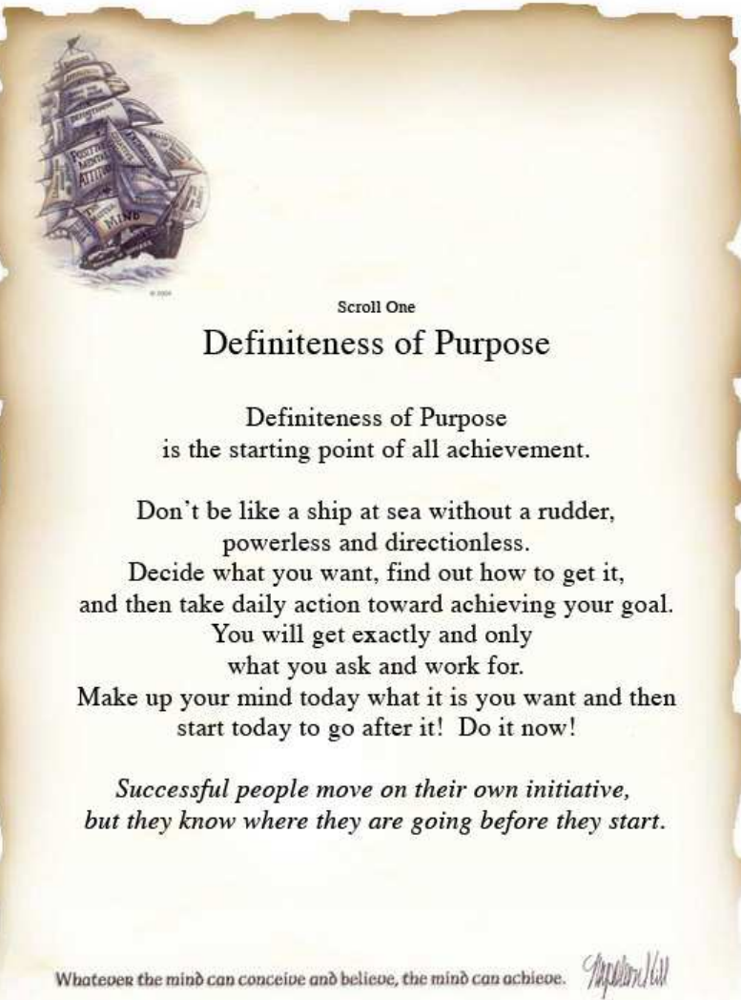

# Welcome to FlowTrade Help

<figure><figcaption>
THE MATRIX 
</figcaption></figure>

### Our Vision and Mission 

> We are a group of traders that have come together through various avenues including wealth fund management, algorithmic solutions, dark pool exchanges, floor trading, and more. Over time, we have bonded and created a community to help give retail traders an edge. Our number one goal from the beginning was to provide a chance for retail traders to succeed as a traders - forging a path through all the noise and nonsense out there that cause traders to fail. We have spent years developing tools, strategies, mentalities and courses to help set you up for success. We have a full system that has been developed for any trading style: long, short, or swing as well as various options strategies. It is a very high probability system by itself, but is specifically designed to work alongside the Flow Index and Dark Pool Index. So if you’ve been wandering, lost or have been struggling for awhile, but have something inside you that tells you success is possible…. CONGRATULATIONS and welcome! You have finally arrived on that path. This guide will help you get familiar with our tools, system and how we do things. Note that it is primarily for the web version - you will find a desktop guide linked below. Our chat room happily welcomes any traders (new or older) who want to get to know us and learn a bit more about our trading style, knowledge, and tools before committing to our software. “You never know what you can do until you try, and very few try unless they have to.” - C. S. Lewis.

<figure><figcaption></figcaption></figure>

* <mark style="background-color:blue;">Email us at</mark> <mark style="background-color:blue;"></mark><mark style="background-color:blue;">**info@flowtrade.com**</mark>

For ease of navigation, the Knowledge Base is divided into several categories that will allow you to quickly find the information you need:


[getting-started](getting-started/)



[analytics-panels](analytics-panels/)



[trading-panels](trading-panels/)



[miscellaneous-panels](miscellaneous-panels/)

