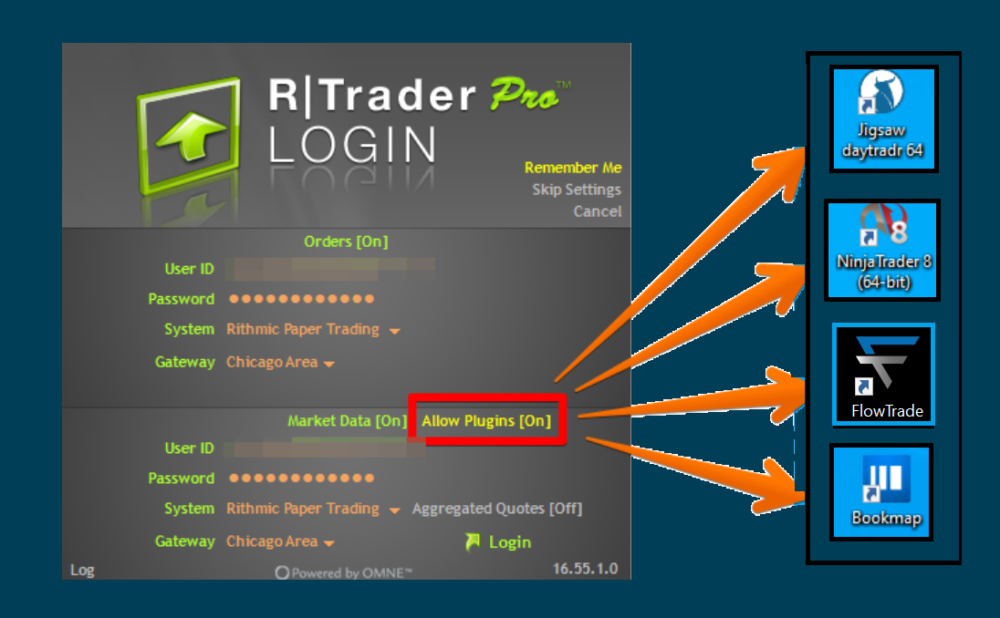

# Rithmic / Trading combines&#x20;

## Connection to Rithmic

Rithmic technology provides access for trading futures and options on CME, CBOT, NYMEX and other exchanges. Full market depth, reliable data and great execution are main features of Rithmic.To connect Flow trade to a broker that uses Rithmic technology, it is sufficient to have (or create a new) account.

* **​**[**Connection for Existed Accounts**](https://help.quantower.com/quantower/connections/connection-to-rithmic#connection-for-existed-accounts)**​**
* **​**[**Connection for New Accounts**](https://help.quantower.com/quantower/connections/connection-to-rithmic#connection-for-new-accounts)**​**
* **​**[**How to activate Market by Order (MBO) data**](https://help.quantower.com/quantower/connections/connection-to-rithmic#how-to-activate-market-by-order-mbo-data)**​**
* **​**[**Problems during the connection to Rithmic**](https://help.quantower.com/quantower/connections/connection-to-rithmic#problems-during-the-connection-to-rithmic)**​**

#### Connection for Existed Accounts 

* **​**[**Download and install R Trader Pro**](http://yyy3.rithmic.com/?page\_id=16) from Rithmic official website.
* Open connection manager, select **Rithmic** and specify the type of connection (**Demo / Real**).
* Click on **Connection Settings** and **activate Use RTrader** option to avoid additonal fees for subscription to market data. If necessary, trader can change the server. By default, the Rithmic Paper Chicago server is set for demo accounts and the Rithmic Aurora Chicago server is set for real accounts.
* Enter your login and password and click **Connect.**

Enter login data for connection to Rithmic Starting from May 1, the [CME exchange сhanged the rules for determining a professional market participant](http://yyy3.rithmic.com/?p=1069), and as a result, increased the fee for the market data. In order to correctly define the professional participant, Rithmic has changed the connection parameters in their platform, as well as in API for platforms such as Flowtrade .To avoid additional fees for subscription to market data, a trader needs to login through the R Trader Pro platform and activate the setting in Flow Trade, which is called **Use RTrader**. hActivate Use RTrader option to avoid additional fees for subscription to market data

<figure><figcaption></figcaption></figure>

#### Creating a New Accounts and further connection 

* **​**[**Create a new demo**](https://rithmic.com/demo.html#sign-up) or open a real account with any broker supporting Rithmic technology, accept agreements, and start using our platform.
* To register [**Rithmic Demo**](https://rithmic.com/demo.html#sign-up) go to their official website ​
* Fill in all the required fields
* Accept _**"Market Data Subscription Agreement"**_ and _"**Market Data Self-Certification"**_
* Account will be activated within 30-60 minutes.

### **How to activate Market by Order (MBO) data** 

**Market by Order (MBO) data** shows the order size of an individual position inside the level2 data for a certain price. To activate the displaying of this data, open the Connection settings and tick on "**Enable 'Market by Order' (MBO) mode**".Enable Market by Order MBO data for Rithmic in Quantower platformAfter activation, you can see this data in the DOM Trader panel.Open **Settings** in the DOM trader panel -> **Columns** -> **Bids/Ask** (if you use split mode or **Bids** and **Asks** as single columns) -> **Size coloring scheme** -> **MBO.** Also, you can set **Filter orders more than (MBO)** if you want to see orders with a certain size.Activating MBO data in Flow Trade platformVisual comparison between Market by Oder (MBO) and Market by Price (MBP)

### **Problems during the connection to Rithmic** 

#### **Market Data Connection Closed (Broken)** 

Sometimes, when connecting to the Rithmic, you may see the error **"**_**Market Data Connection Closed (Broken)".**_ Below we will describe possible reasons and solutions. This error message is most commonly encountered by _**new Rithmic users for various reasons**_ and is not within the control of the Flowtrade platform.Rithmic error "Market Data Connection Closed" in FlowTradeRithmic error "Market Data Connection Broken" in Flowtrade

**Connection to Rithmic can be done in two ways:**

* directly, without using RTrader Pro platform. This approach allows only one platform to be connected.

* through their RTrader Pro platform. This connection uses Plugin Mode and **allows you to connect multiple platforms at the same time (!)**

Use Rithmic plugin mode for multiple access More often such error occurs for the following reasons:

* You didn't accept agreements "_Market Data Subscription Agreement"_ and _"Market Data Self-Certification"_ during the registration on Rithmic's website or in R Trader platform. _We recommend connecting through **R Trader** or **R Trader Pro** platforms to check your account.**Solution:** accept agreements in RTrader Pro platform_
* A new account was created less than an hour ago. Usually, the **full activation of a new account takes from 30 minutes to 1 hour**._**Solution:**_ _open RTrader Pro platform and connect with your login. If the connection is successful, then your account is active in Rithmic system_
* Make sure that your login matches the Demo or Real connection_**Solution:**_ try both connection options in Flow Trade

* If Flowtrade was connected to Rithmic before via the RTrader Plugin (i.e. the checkbox Use RTrader is active), and at the moment the RTrader Pro platform is not connected or the **Allow Plugins** option is not active there, then Flowtrade will not be able to connect._**Solution (several different options, not step-by-step):**1) start RTrader Pro platform with **Allow Plugins** mode and connect again to your account in Quantower2) try to connect to Rithmic as a direct connection: close RTrader Pro platform, disable **Use Rtrader** option in Flowtrade settings and restart Flowtrade. After start Flowtrade again and connect to your account as a direct connection_

Plugin Mode in RTrader Pro is disabled but active in Flowtrade

* In the case of a direct connection (without RTrader Plugin mode), you cannot use the same login on different platforms at the same time. The connection can be only one login on one platform (!).When trying to connect with one login on different platforms, it can log out from the first platform (which was connected), but the login on the second platform will not be successfully connected (on which we are trying to log in)._**Solution:** use RTrader Plugin mode for multiple connections or close all platforms and connect via Flowtrade as direct connection (without Rtrader plugin mode)_

* The error can be encountered because the Rithmic server is unavailable to be connected to. This error commonly can be encountered over the weekend. In this case, it is best to wait until Sunday evening to see if you can connect to determine if this is the problem or there is some other problem.
* Rithmic demo accounts are limited to 14 days per exchange guidelines on providing live, streaming data. If you have used a Rithmic demo previously you will _not_ be able to login with a new Rithmic demo Username.
* If you are unable to connect within a few days, you need to contact your broker about this issue.

If you enable Use RTrader plugin in Connection Settings and still can not connect to Rithmic, please check that you have more than 1 active session for Market data.

#### No Level2 data for some symbols 

This problem can be due to the fact that you do not have a subscription to this Level2 data. To check this, launch the **RTrader Pro platform** and open the **Order Book** panel.If you don't have Bid/Ask values in the RTrader platform, you need to subscribe to this data via Rithmic's support. After that, you will see level2 data in our platform as well.

#### ERROR: Only Admins Can Place Trades 

This means that the Evaluation account has been failed and has been disabled.It either means you have reached your Trailing Threshold Drawdown or that you have held a trade past 4:59 PM ET.To resolve this issue, please contact support team of your Prop Trading company
