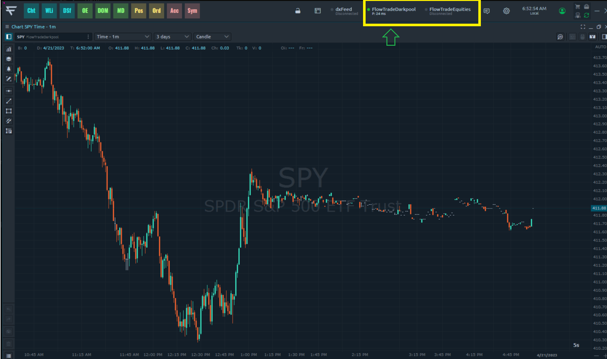

# 🥷 DarkPool Connection

<figure><figcaption>
Dark Pool Data feed
</figcaption></figure>

## DARK POOL INDEX & BLOCKS

you will see 2 Flow Trade connection feeds.  One says equities and the other one says Dark pool.  These data feeds are completely the same besides the use of the power trades tool.  The power trades tool Is out block and high volume scanner.  Unlike the web version were we only track the registered blocks that come through on the tape.  There are various settings on the scanner that allow you to isolate specific levels that may have HFT programs unloading small lots to be undetected.  These levels are just as critical as the block levels.  Please check out the Power trades tab or watch this video to learn more abou this tool.



<mark style="color:blue;">**What is a dark pool?**</mark>

A dark pool is a private trading system or exchange used to trade securities anonymously or ‘in the dark’; traders typically can’t see other parties’ information regarding buying and selling securities until a transaction has gone through. Dark pools stand in contrast to traditional ‘lit’ pools, where offers to buy or sell securities are made publicly and transparently.&#x20;

These transactions are a type of alternative trading system (ATS) operated by a broker-dealer, rather than going through a public exchange like the New York Stock Exchange (NYSE). Dark pools have become far more common in the investing world today.&#x20;

Algorithmic trading and high-frequency trading (HFT) are two forms of trading that are executed without any human input. The computer programs will execute huge block trades within fractions of seconds and ahead of other investors.

Since HFT floods the trading volume on public exchanges, the programs need to find ways to break larger orders into smaller ones. This is accomplished by executing smaller trades on different exchanges, as opposed to one financial exchange. By doing this, it minimizes front running and avoids showing where these trades were executed. There are many reasons why dark pool trade exists. Some of the other uses are:

* <mark style="color:blue;">**Institutional investors**</mark> - Large investors like hedge funds have billions of dollars in assets under management (AUM). These firms use dark pools to buy stocks without causing large swings in the market.
* <mark style="color:blue;">**Share repurchases**</mark> - Buybacks are one way in which companies reward their shareholders. By buying back their shares, they boost the stock’s earning per share EPS. These firms tend to acquire these shares over a long period.
* <mark style="color:blue;">**High Frequency Traders**</mark> - HFT are companies that use algorithms to execute large share purchases. These firms use dark pools to lower fees and to ensure that the market is orderly.
* <mark style="color:blue;">**Broker-lead dark pools**</mark> - An online broker like Schwab can group several transactions among its clients before sending the

### _Using the Dark Pool Index_

The Dark Pool Index (DPI) operates a lot differently than the Flow Index. While price moves day to day from the programs of the Flow Index, price does not move day to day from the action that comes from dark pool exchanges. The DPI is going to be more of a puzzle approach; often, they will place orders that don't make any sense until after the fact has been revealed. We do not try to keep up with their moves because they are utilizing a lot more capital and can endure long duration drawn downs or even inaction. We like to watch them load or unload at major big picture levels to help us dictate what the next wave or trend is going to be. This is another tool that you must pair with your big-picture technical analysis.

<figure><figcaption></figcaption></figure>

## DARK POOL BLOCK TRADES

Block trade levels display where the major high volume and high value transactions have taken place. When the big players take trades of this size, we take note because these are major levels of support and resistance. This is where our biggest advantage is when using the dark pool block trades. We use these levels in conconjunction with our technical indicator tools to prepare for our swing entry and exit levels. For example, if we see a bunch of block trades on SPY at a specific level and price is trading above that level and finds support on that level, we can assert that a firm has taken a hefty long position and it’s a major support level. The common theme for these levels is bullish above and bearish below.\

## Flow Trades Pro - Rolls Royce Dark Pool Specialist

_Our in house pro trader Rolls Royce(Brian) is a professional dark pool trader and has engineered his own data interpreting abilities and system. He has a passion for trading teaching and loves to share his extensive knowledge in this department. He often holds classes regarding dark pool and how to incorporate interpret the data into a trading plan._

<figure><figcaption></figcaption></figure>

\
\
\
