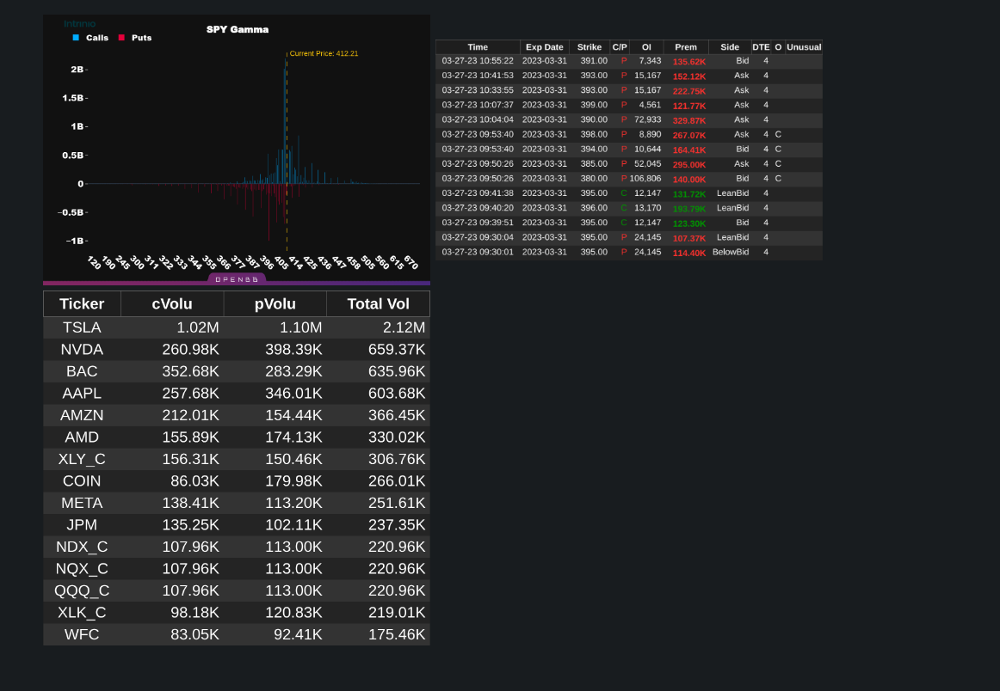
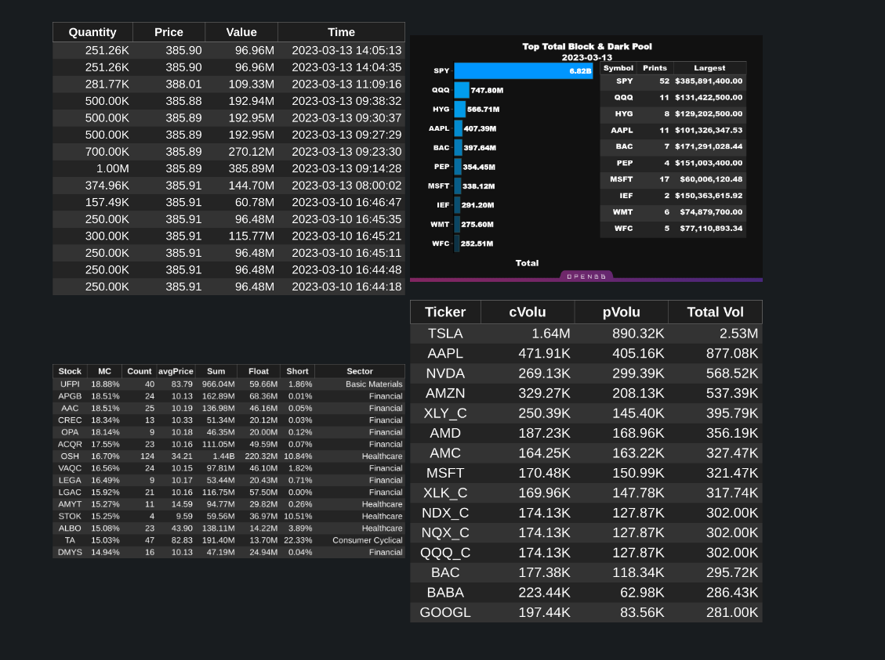
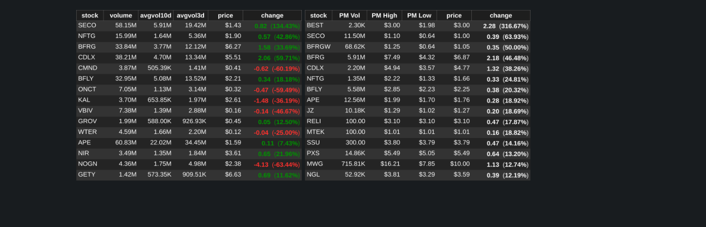
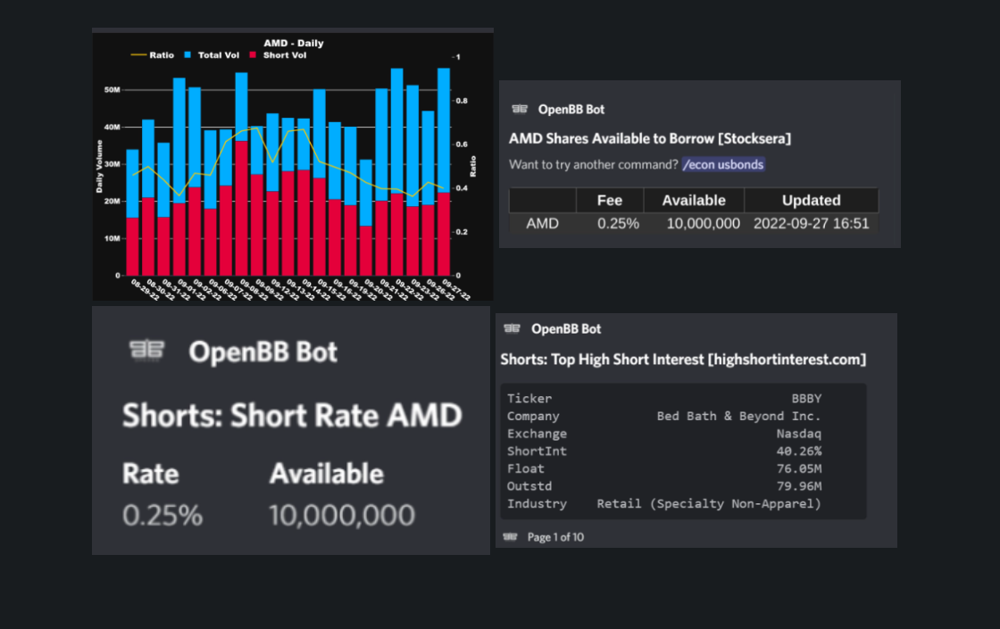
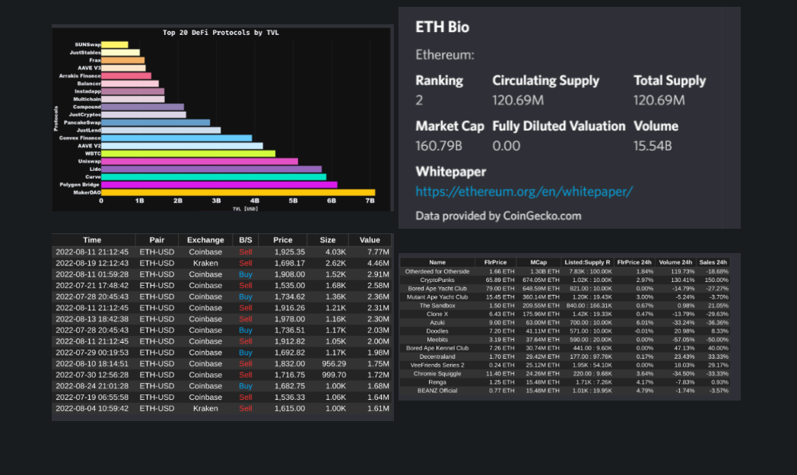
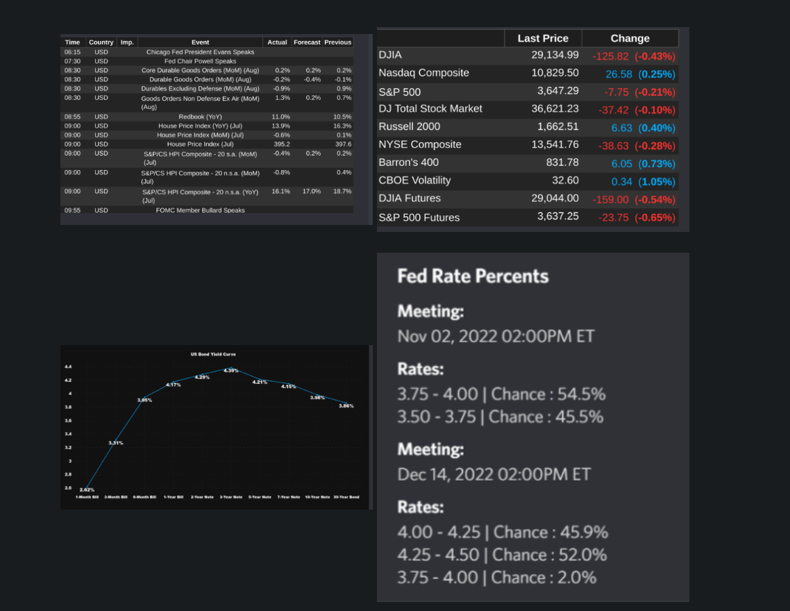

# 🤖 Flow Data Bot&#x20;

### <mark style="color:blue;">OPTIONS</mark>

CHARTS - OPEN INTEREST - OPTIONS FLOW - VOLATILITY - SURFACE FLOW-PREMIUM MAX PAIN - GAMMA

<figure><figcaption></figcaption></figure>

### <mark style="color:blue;">DARKPOOL</mark>

Sector blocks - top summary - all prints

<figure><figcaption></figcaption></figure>

### <mark style="color:blue;">SCREENERS</mark>

Use the screener commands to quickly find After or Premarket Movers, Top Gainers, and many other technical or fundamental parameter's

<figure><figcaption></figcaption></figure>

### <mark style="color:blue;">SHORT</mark>

Find the next squeeze or get the latest short rates on any stock.

SHORT VOL - BORROWED - SHORT RATE - HIGH SHORT INTEREST

<figure><figcaption></figcaption></figure>

### <mark style="color:blue;">CRYPTO & NFT</mark>

Quickly chart your favorite NFT floor price or get more info on your collection

Explore the world of Crypto with our best in class offerings

<figure><figcaption></figcaption></figure>

### <mark style="color:blue;">ECONOMY</mark>

Get the daily calendar, check the latest yield curve, or just find the next FED meeting

<figure><figcaption></figcaption></figure>
