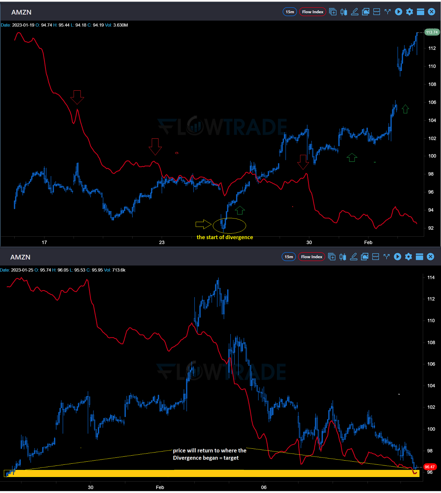
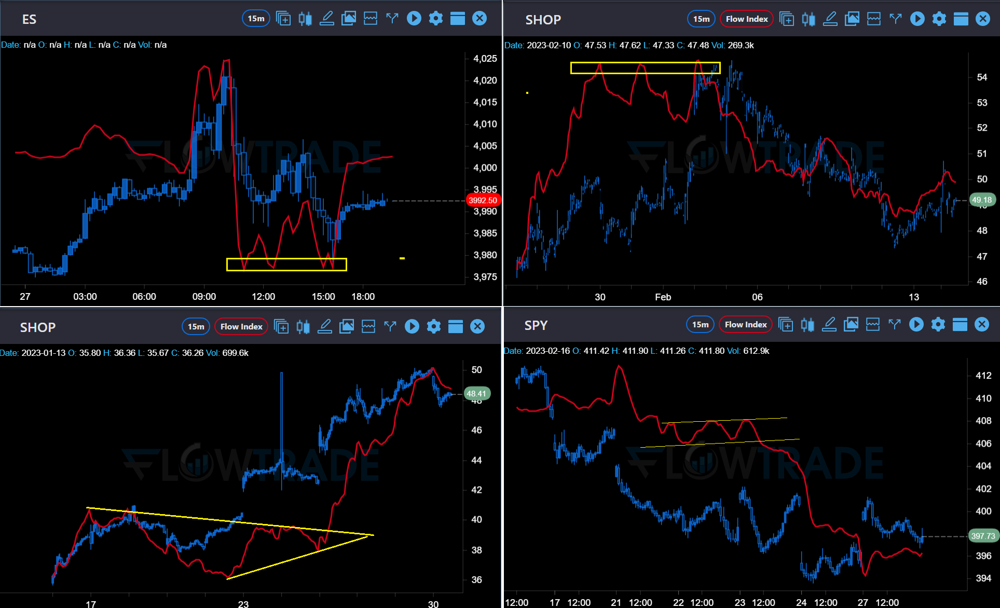
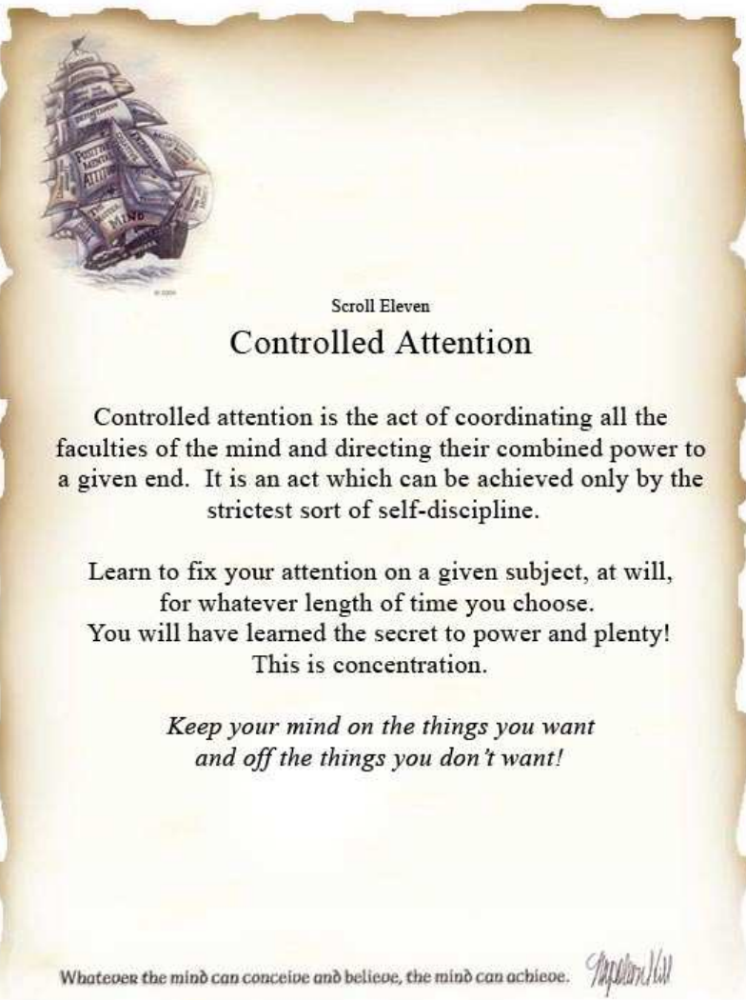

# 🤖 Flow Index

## What is Flow Index

| 
Tape reading is a lost art. Knowing this, we developed the Flow Index as a software program that gathers the buy and sell orders from the tape and cohesively create a single line to indicate net buying or selling. It’s a method we learned from an ex-market maker and wealth manager that had been trading for more than 35 years. He was part of developing the programs that were first implemented into the exchanges, which later changed trading forever.  Despite all that has changed in the market, the truth of the tape has never changed. If you know what to look for and stick to your disciplines, reading the tape can give you an in-depth perspective of what the big players are doing behind the scenes.

<mark style="color:red;"><strong>PRICE DATA IS NOT USED</strong></mark>. The Flow Index identifies buying and selling, which is sometimes different than what the price action shows. Not all up moves come from buying and not all down moves come from selling.  HFT programs can affect prices so quickly that what may appear to be a large move in price is actually an HFT or rapid burst program taking out limit orders over a range of prices 'providing liquidity'.  Many times, it's only manipulation and the Flow Index will help you identify what is really going on. This will not only help you avoid being faked out or yanked around by price direction, but provide opportunities as well. 

 

<em>Take a look at the image below.</em>

 |
| ------------------------------------------------------------------------------------------------------------------------------------------------------------------------------------------------------------------------------------------------------------------------------------------------------------------------------------------------------------------------------------------------------------------------------------------------------------------------------------------------------------------------------------------------------------------------------------------------------------------------------------------------------------------------------------------------------------------------------------------------------------------------------------------------------------------------------------------------------------------------------------------------------------------------------------------------------------------------------------------------------------------------------------------------------------------------------------------------------------------------------------------------------------------------------------------------------------------------------------------------------------------------------------------------------------------------------------------------------------------------------------------------------------------------------------------------------------------------------------------------------------------------------------- |

<figure><figcaption>
Divergence example
</figcaption></figure>

## Divergence Direction and Absorption

\-When price is falling and the Flow Index is rising, this is positive divergence; it's identifying that they're buying into the lows.

\-When price is rising and the Flow Index is falling, this is negative divergence; it's identifying that they're selling into the highs. (shown in the image)

\-When price is rising and the Flow Index is rising, this is a normal pattern you'd expect to see.

\-When price is falling and the Flow Index is falling, this is a normal pattern you'd expect to see.

\-When price is either falling or rising and the Flow Index is flat, it's telling you that there is equal --   pressure on both sides.

\-When the Flow Index is rising or dropping and price is flat or sideways, then it means that buying or selling is being absorbed.

<figure><figcaption>
Here are some examples of simple patterns.
</figcaption></figure>

## Trends - Channels - Patterns

All of the typical patterns you come across on price will also be reflected on the Flow Index line.  For example: double tops, triple tops, wedges, flags, simple channels, and trendlines.  These are used as a forecasting signal, because these form before they are fully developed on price action. This allows you extra time to make your decision as well as being able to spot when their behavior is going to change. These programs are fast so you’ll want to take advantage of any tools that can forecast their behavior. If drawing patterns is something new to you, please watch some videos in our library and get involved in our chat room. There are tons of people that have gained success with our tools and are more than happy to pass their knowledge along.

## The difference between 1min and 15min time frames

The 1 minute time frame is going to be used for our day trading. You're going to want to stick with the 1 minute chart for entries and exits as well as intraday divergence. Roughly 90% of the time, the 1 minute divergence is going to trade out to its target that same day with an exception to the first 5 minutes of the day and the last 10 minutes of the day due to the flurry of programs.&#x20;

It's important that you are using other tools to support your reading of the Flow Index because it is not a stand-alone tool. It’s meant to be used with proper technical analysis, to support or denounce your analysis.&#x20;

A common mistake most users make when first starting, is seeing divergence, getting excited and quickly jumping into the trade without making sure that their other technical analysis tools confirm the entry. When this happens, they quickly find out that the divergence wasn't done developing and have to exit the trade for a loss, only for the divergence to later trade out to their target. So if you are lacking in the technical analysis department, please spend some time in the library or with some of the Pros; ask as many questions as you possibly can. Our flow channels are specifically designed to work alongside the Flow Index. (Ask an admin about our flow channels.)

The 15 minute time frame is going to be for a broad big picture perspective; allowing you to see what the overall market is doing or preparing to do for swing trades. The bread and butter is when you learn how to read the 15 minute divergence and properly prepare your entry at the market bottom or top of a major trend. Once you get this down to a science, you’ll not only yield enormous gains, but you’ll laugh at the analysts on TV as they predict what’s to come because you’re already ahead of the game! With all that said, we have seen many divergences go on for over a month and diverge as much as $300; which can be deadly if you do not take the proper entry. Please do not learn this the hard way and be patient when understanding how to execute on the 15 minute time frame.

<figure><figcaption></figcaption></figure>
