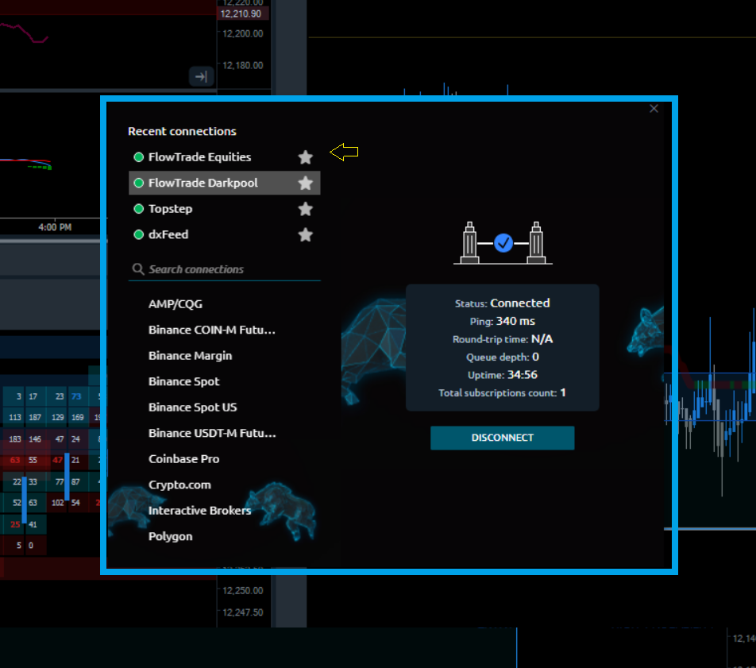

# 💫 Installation/Connecting

* [**System Requirements**](installation.md#pc-requirements)\*\*\*\*
* [**Installation Steps**](installation.md#installation-steps)
* [**Uninstallation**](installation.md#uninstall)

Once you downloaded Flowtrade application from Flowtrade official website — you are ready to start an installation process. From this point we must clarify the main differences between Flowtrade "installation process" and default Windows® install process, that most users are accustomed to.


Flowtrade does not copy its files to the system folders (AppData or Program Files) of the OS, nor does write changes to the system registry


What does it mean? The program doesn't violate the integrity of the OS, and in case of removal, it will not leave any prints of its presence on your computer. Flowtrades "installer" literally extracts files to the user-specified folder.

This approach allows you to store (and launch) the Flowtrades on removable drive for use on any other computer as the portable application. It can be convenient when you need to move Flowtrades with all of its settings to another PC; just copy Flowtrade folder and paste where you need.

### PC requirements


* Windows 10, 11
* [.NET Framework v.4.8](https://dotnet.microsoft.com/download/dotnet-framework/thank-you/net48-web-installer) 
* Available disk space — 1 GB (depends on the volume of loaded history)
* **The hardware requirements for Flowtrade depends upon what you are doing with it.** Most desktop systems can run Flowtrade without any difficulty.
* The following hardware specifications, are very much recommended for a fast system: 16 GB RAM, minimum of 4-core CPU, and an SSD (solid-state drive).



**Microsoft has officially stopped supporting Windows 8 and Windows 7**. Therefore, the platform may not start or may work incorrectly. [For more information on supported versions, please check the official Microsoft website.](https://support.microsoft.com/en-us/help/13853/windows-lifecycle-fact-sheet)\
\
We recommend using Windows 10.


### Installation steps

1. [**Download the app installer**](http://flowtrade.live/Download) and launch 
2. Select the folder to extract application files
3. Once an extraction process being finished the platform will start automatically with 4 chart grid but no data connected.


Please note, that you may need to allow an in-going and outgoing connection for _**Starter.exe**_ file (the main executable of Flowtrade terminal) in your Firewall settings


### Connecting

Next steps will be logging in to your account and connecting to a data feed

<figure><figcaption></figcaption></figure>

* Next click to open and build a work space from a premade template. Or simple start building your workspace out from here.(image below)
* Please click on a star and favorite your data feeds that you are using. your favorites will remain on top bar.  (image below)
* Once you are logged in click the Flowtrade data location to connect to both dark pool and equites connections.
* If you have an account please log in to unlock all the features
* If you havent already  please register an account by clicking the profile icon.

<figure><figcaption></figcaption></figure>
