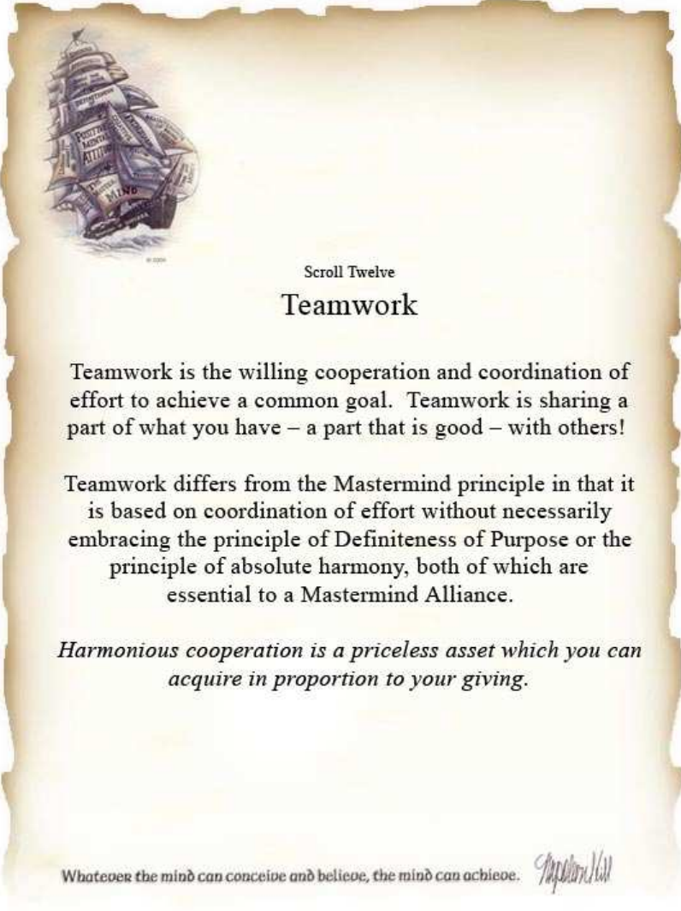

# 😎 MEET THE TEAM

<figure><figcaption></figcaption></figure>

* <mark style="color:blue;">**Joshua (RENEGADE)**</mark> - Owner of Flow Trade with over 10 years of trading and market experience. Josh has helped create a lot of the Flow Trade system and is continually dedicated to adding and improving the tools used within the system. His passion in helping traders achieve success is the driving force behind Flow Trade. With a trading style that is aggressive and highly calculated, Josh trades options, equities and futures. As a Cycle trader and Fibonacci Master, he can quickly analyze the market from big picture down to execution.
* <mark style="color:blue;">**Mike (TRACKS)**</mark> - Owner of Flow Trade with over 20 years of trading and market experience. He is responsible for engineering a big part of the Flow Trade system and its proprietary indicators. He's passionate about creating technical analysis tools that limit the gap between analyzing the trade to execution. Similar to Joshua, he’s incredibly passionate about helping traders achieve success. Mike’s trading style is methodical and precise, much like a surgeon. He’s a master at harmonizing multiple time frames and tools to work synergistically.
* <mark style="color:blue;">**Xavier (STYLE)**</mark> - FT PRO - He's a master at the entire flow trade system and has a professional comprehension of Gamma/Delta calculations and options flow. Xavier has even created his own personal tools and indicators to represent the data in a digestible format for all users. He's passionate about Flow Trade and its mission and is always keen to give back to the new users.
* <mark style="color:blue;">**Rebecca (BLONDE BROKER**</mark><mark style="color:blue;">)</mark> - FT PRO - She is the most well-rounded team member with complete mastery of the Flow Trade system and all harmonics patterns and wave theory. Rebecca has the natural ability to recognize patterns and execute them without hesitating. She has incorporated her harmonic ideas with the Flow Trade system to create high-probability trade setups that are easy to follow. Her passion for helping and contributing to the Flow Trade team is unmatched.
* <mark style="color:blue;">**Brian (ROLLS ROYCE)**</mark> - FT PRO - He is a data mastermind. So much so that he created his own dark pool analytic system for trading equities and options. Brian incorporates the Flow Trade system methodically alongside his long history of dark pool experience and has even engineered his own system of interpretation using the Dark Pool Index (DPI). He shares alerts for important buy and sell zones and even teaches classes to share his knowledge and experience.
* <mark style="color:blue;">**Rayman (RAYMAN)-**</mark> FT PRO - Former market maker for over 10 years on wall street, he got burned out with the lifestyle and decided to take his skills to use them independently. Rayman is a master at futures market, daily levels and knowing the behavior of the traders on the other side of the trade.
* <mark style="color:blue;">**Sallington**</mark> <mark style="color:blue;">**(SALLINGTON)**</mark> FT PRO - Sallington has taken the Flow Trade tools and created his own system to become a master futures trader. His precision on entry and target levels for /ES and /NQ is consistently flawless. Having been a student of Linda Raschke and her methods, he's taken what he learned and tied it all together into an easy to digest and high probability day trading system of his own. He's readily available in the chat room to share his experience and trading journey.
* <mark style="color:blue;">**Brent (THE BEAR**</mark>) FT PRO -  bear is another very well rounded trader.  He excels in all technical aspects of trading and can put rhyme or reason to any situation.  Hes a fib master and constsantly building and coding new tools to make things easier for traders!  Outside of his technical expertise, he has the biggest heart of the team and is like a real life teddy bear.  Always willing to spend his personal time for someone else or the team!
* <mark style="color:blue;">**Kevin (KEVINS3777)**</mark> FT PRO - Kevin is our go-to guy to get things handled behind the scenes because he’s a power administrator and social engineer. He’s like an octopus handling all the working pieces of software paper and account management. Part of the onboard team, he’s there to guide new members and help them get acclimated to the system.

<figure><figcaption></figcaption></figure>
