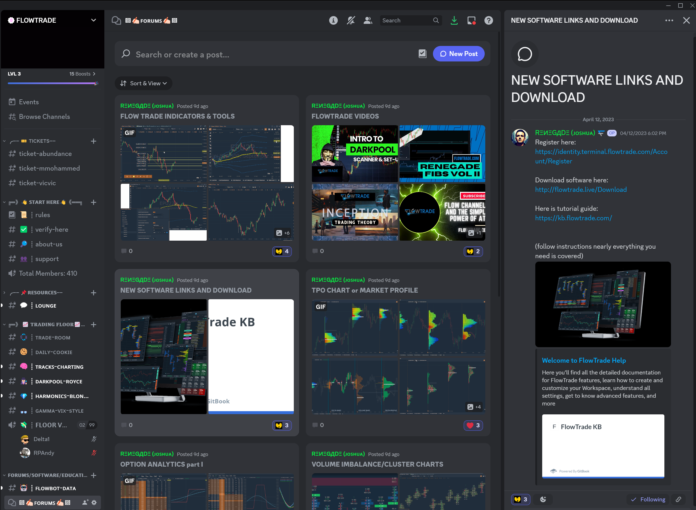

# 🧠 Our Daily Flow

_<mark style="color:red;">**How to navigate Discord Chat Room:**</mark>_

Once inside, you’ll see three main groups of channels: ‘Start Here’, ‘Resources’, and ‘FlowTrade Main’.

The channels under ‘Start Here’ and ‘Resources’ are self-explanatory, so feel free to poke around to get a feel for them.

Under ‘Resources’, you’ll see the ‘support’ channel. Whenever you’re running into technical, billing, or membership issues, please use that channel to create a ticket for us to help solve your issue as quickly as possible.&#x20;

Now, let’s get to the meat and potatoes of our Discord - the ‘FlowTrade Main’ group of channels. Here is a brief description for each of the channels:&#x20;

<figure><figcaption></figcaption></figure>

_<mark style="color:blue;">**TRADINGFLOOR**</mark>_ - This is where we all meet in the morning to trade together.  You’ll find alerts, discussion, charts and anything related to trading and what's going on in the market.

_<mark style="color:blue;">**DAILY-COOKIE**</mark>_ -  This is the daily market sentiment given by Renegade about 30 minutes before market open. It includes trade set-ups, current cycles, earnings alerts, social sentiment, potential trade alerts, guidance and much more.

_<mark style="color:blue;">**TRACKS-CHARTING**</mark>_ - This is where Tracks (Mike), the pro of understanding the precise transition from bullish to bearish price action and vice versa, gives his daily morning analysis of SPY to help gauge the overall market sentiment.\
_<mark style="color:blue;">**DARKPOOL-ROYCE**</mark>_ - This is where Royce (Brian) shares his wisdom of what's actually happening behind the curtains in the dark pool.\

_<mark style="color:blue;">**HARMONICS-BLONDEBROKER**</mark>_ - This is where Blonde Broker (Rebecca) gives her exceptionally accurate market analysis of her trades, specializing in waves and harmonics.

_<mark style="color:blue;">**GAMMA-VIX-STYLE**</mark>_ - This is where Style (Xavier) shares how the delta/gamma structure and VIX is affecting the market and how to prepare for it to be on the right side of the trade.

<mark style="color:blue;">**FLOOR VOICE**</mark> <mark style="color:blue;"></mark><mark style="color:blue;">-</mark> Lead by Tracks and Renegade, this is where daily live voice conversations are held between FlowTrade members during market hours to discuss market sentiment, strategies, and trade set-ups. The conversation starts about 10 minutes before the 9:30 AM market open and all members are encouraged to join because of the valuable information shared during this time - a lot can be learned during these calls.

_<mark style="color:blue;">**FLOWBOT-DATA**</mark>_ - This is where any FlowTrade member can type in commands to pull up unique market data such as general analysis, economy data, screeners, dark pool, options data, NFT, and crypto. Please reach out to one of the admins to learn how to use this channel and pull the data that you’re looking for.

_<mark style="color:blue;">**FORUMS-**</mark>   Here you will find videos and topics on all of our tools as well as you can feel free to start a topic or ask questions about a current topic<mark style="color:blue;">**.**</mark>_

_<mark style="color:yellow;">**Best use of our Discord:**</mark>_ Throughout the day (even after market hours), feel free to get feedback on your trade set-ups, ask questions about any of the tools used, or discuss just about anything pertaining to trading. Everyone in the group is very welcoming and wants to see you succeed. The best and fastest way to learn is to speak up - we all started somewhere. It's a long lonely road trying to become a successful trader on your own. So please use the admin and Pros to your advantage. \
\
If you would like a private session for help on setting things up or just acclimated to the tools, please message Kirby and he will get you scheduled.

_<mark style="color:yellow;">**CLASSES & TRAINING**</mark>_

We hold free classes randomly throughout the week and on the weekends too. These classes can range from how to use our tools, to developing your trading system, to learning how to use dark pool data, to how to pass prop trading combines - just to name a few. As we progress, these classes will become more and more consistent.

If you’re the type that prefers more one-on-one coaching, please feel free to reach out to [info@flowtrade.com](mailto:info@flowtrade.com) or submit a ticket under the ‘support’ channel to let us know.\

<figure><figcaption></figcaption></figure>
