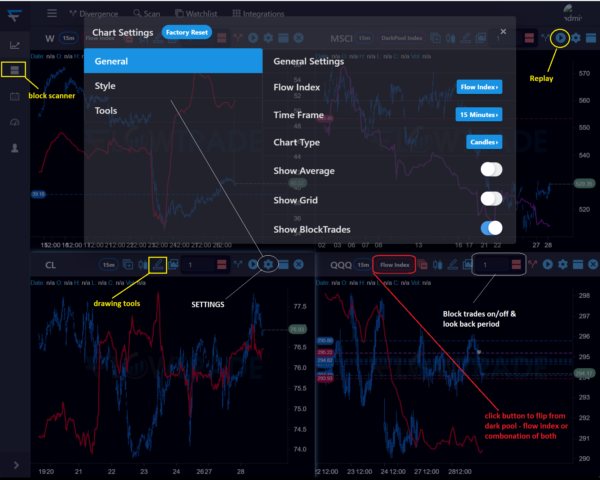
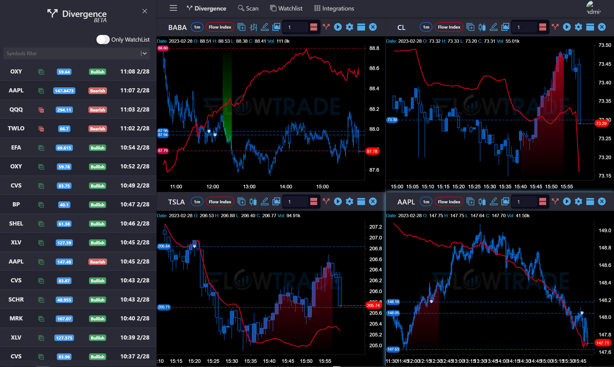
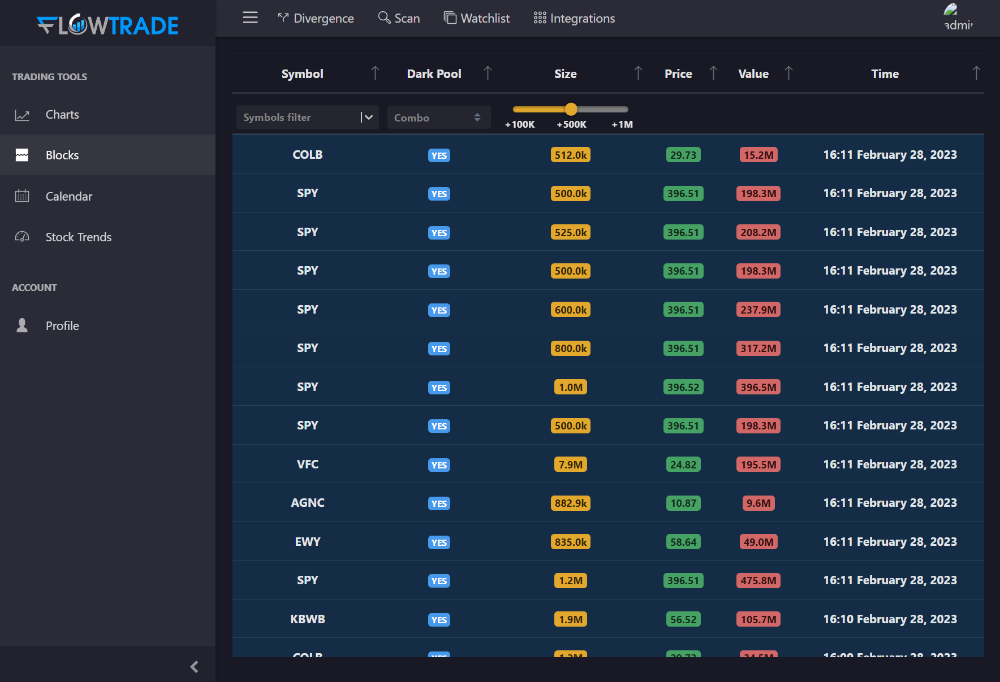

# 🕸 Web Platform

Platform tabs and tools (web version):

The main tabs and icons have been labeled accordingly in the image below. Feel free to play around with the settings in your FlowTrade account for each item so you can understand its action.

<figure><figcaption></figcaption></figure>

Divergence Scanner (web version):

The divergence scanner picks up divergence between price action and the Flow Index. There are two ways to use the divergence scanner.&#x20;

The first way is to click on the upper left icon that says ‘Divergence’. That will bring up a list of tickers that have bullish or bearish divergence.

The second way is to click on the divergence icon on each individual chart to show divergence for that specific ticker. As you can see in the image below with each individual chart, there is a green cloud for bullish divergence and a red cloud for bearish divergence.&#x20;

It’s important to note that this is beta only on the web version. Although it produces very high probability results, you cannot rely on this alone. There are times when it displays a false divergence because it doesn’t pick up all the buying or selling that’s out there.

<figure><figcaption></figcaption></figure>

Block Trades Scanner (web version):

Along the left side, you’ll see the ‘Blocks’ tab. This is where you can filter through regular and dark pool block trades by size, price, value, and date.

<figure><figcaption></figcaption></figure>

## Educational Library&#x20;

[https://learning.flowtrade.com/](https://learning.flowtrade.com/)

## Desktop Version

Desktop Version:

Our desktop version is much more extensive and offers these tools plus many more. Click here for the full start-up guide for the desktop version: [http://flowtrade.live/Download](http://flowtrade.live/Download)

<figure><figcaption></figcaption></figure>
